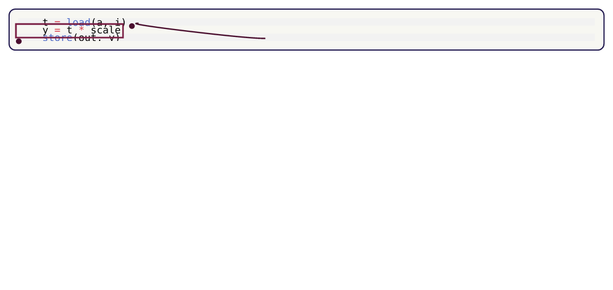
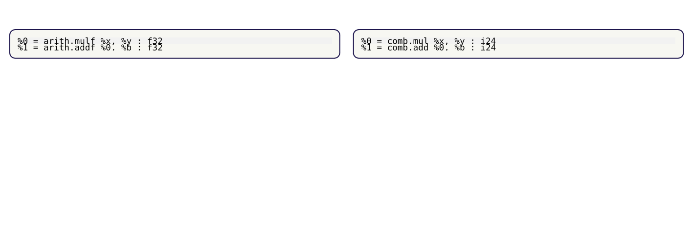
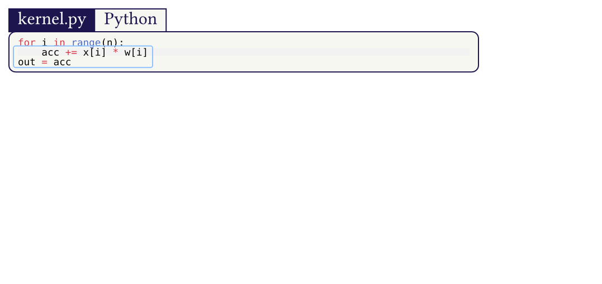
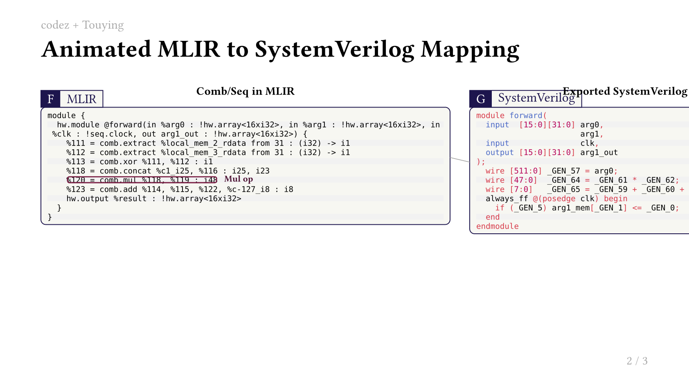
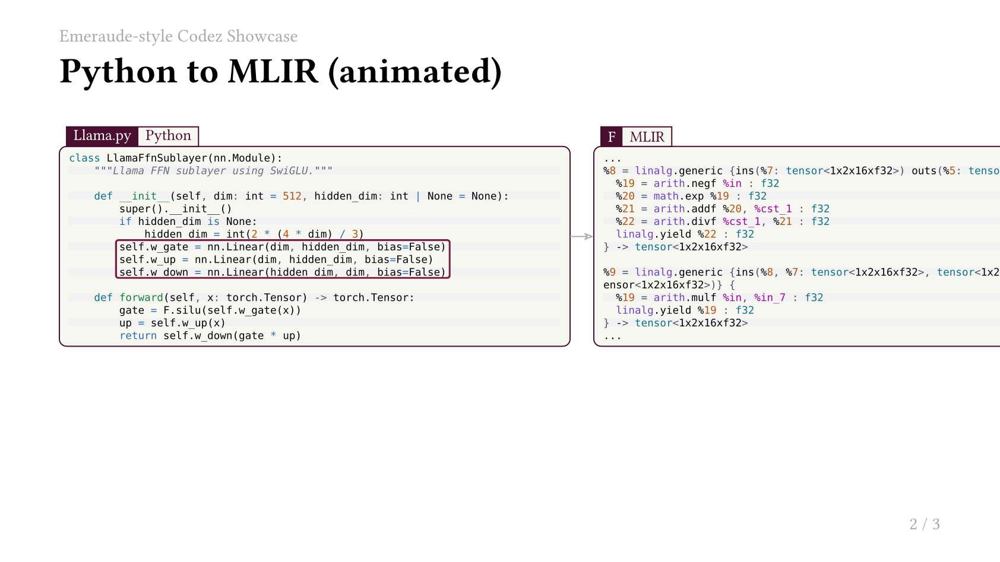

## codez

Mark and annotate code blocks with geometry-friendly anchors.

`codez` is built for technical slides and posters where code is not just text, but a visual object you want to point to, frame, and connect.

### Why this package

- Keep code readable while adding presentation overlays.
- Mark semantic regions once, then reuse them for bboxes, dots, arcs, and custom drawings.
- Handle indented snippets cleanly with `trim-left: true` so highlighted boxes hug real code tokens.
- Use `block(...)` for document flow and `cetz-block(...)` inside custom Cetz layouts.

### Install

```typ
#import "@preview/codez:0.1.0": *
#show: init.with()
```

### Quick Example (Indented Code + Tight Bounding Box)

```typ
#import "@preview/codez:0.1.0": *
#show: init.with()

#let src = "    t = load(a, i)\n    y = t * scale\n    store(out, y)"
#let mul = mark("mul", start: 2, end: 2, trim-left: true)

#block(
  name: "demo",
  code: src,
  lang: "c",
  marks: (mul,),
)

#bbox("demo", mul)
#dot("demo", mul, which: "east")
```

`trim-left: true` makes the box start at the first non-blank character of the marked line instead of the indentation column.

### Slide-style Overlay Example

```typ
#import "@preview/codez:0.1.0": *
#show: init.with()

#let src_a = "%0 = arith.mulf %x, %y : f32"
#let src_b = "%0 = comb.mul %x, %y : i24"
#let a = mark("a", 1, 1, trim-left: true)
#let b = mark("b", 1, 1, trim-left: true)

#grid(
  columns: (1fr, 1fr),
  gutter: 12pt,
  [#block(name: "hl", code: src_a, lang: "mlir", marks: (a,))],
  [#block(name: "ll", code: src_b, lang: "mlir", marks: (b,))],
)

#overlay(
  anchors: (
    "from": ("hl", a, "east"),
    "to": ("ll", b, "west"),
  ),
  (at, shift, pts, d) => {
    (d.line)(at("from"), at("to"), stroke: 1.2pt + rgb("#7a1f44"))
    (d.circle)(at("from"), radius: 1.8, fill: rgb("#7a1f44"), stroke: none)
    (d.circle)(at("to"), radius: 1.8, fill: rgb("#7a1f44"), stroke: none)
  },
)
```

### Poster / Canvas Example

Inside Cetz, use `cetz-block` to place fully stylable code panels with badges and marked zones.

```typ
#import "@preview/cetz:0.3.4"
#import "@preview/codez:0.1.0": mark, cetz-block

#let loop = mark("loop", start: 2, end: 4, trim-left: true)

#cetz.canvas(length: 1pt, {
  import cetz.draw: *
  cetz-block(
    name: "panel",
    at: (0, 0),
    width: 320pt,
    wrap: true,
    code: "for i in range(n):\n    acc += x[i] * w[i]\nout = acc",
    lang: "python",
    marks: (loop,),
    badge-tag: "kernel.py",
    badge-lang: "Python",
  )
})
```

### Public API

- `init`
- `mark`, `bbox-mark`, `mark-char`
- `parse`, `pick`
- `block`, `cetz-block`
- `bbox-info`, `anchor`, `bbox`
- `canvas`, `overlay`, `dot`, `arc`

### Repository Examples

- [Quick start](examples/quickstart.typ)
- [Slides overlay](examples/slide-overlay.typ)
- [Poster panel](examples/poster-panel.typ)
- [Touying animation (MLIR to SV)](examples/touying-mlir-sv-animated.typ)
- [Emeraude-style Touying showcase](examples/touying-emeraude-showcase.typ)

### Preview Gallery

[](docs/previews/quickstart.pdf)
[](docs/previews/slide-overlay.pdf)
[](docs/previews/poster-panel.pdf)
[](docs/previews/touying-mlir-sv-animated.pdf)
[](docs/previews/touying-emeraude-showcase.pdf)

Experimental HTML export for the Touying deck:
- [Open `touying-mlir-sv-animated.html`](docs/previews/touying-mlir-sv-animated.html)
- Typst HTML export currently ignores parts of Touying/CeTZ layout, so PDF/PNG previews are the reliable ones.

MLIR color style used in the examples is bundled in:
- [`syntaxes/codez-light.tmTheme`](syntaxes/codez-light.tmTheme)
- [`syntaxes/mlir.sublime-syntax`](syntaxes/mlir.sublime-syntax)

### Publish Workflow

- [Publishing checklist](docs/PUBLISHING.md)
- Local validation: `./scripts/check.sh`

### Credits

`codez` vendors and extends parts of `codly` (MIT), adapted for geometry-aware overlays.
See [THIRD_PARTY_NOTICES.md](THIRD_PARTY_NOTICES.md).
