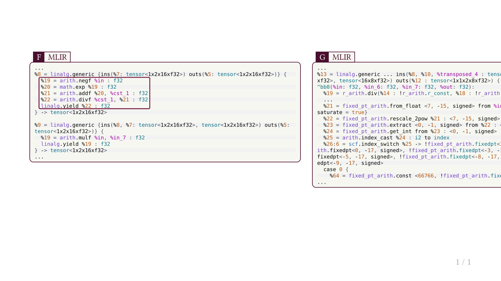
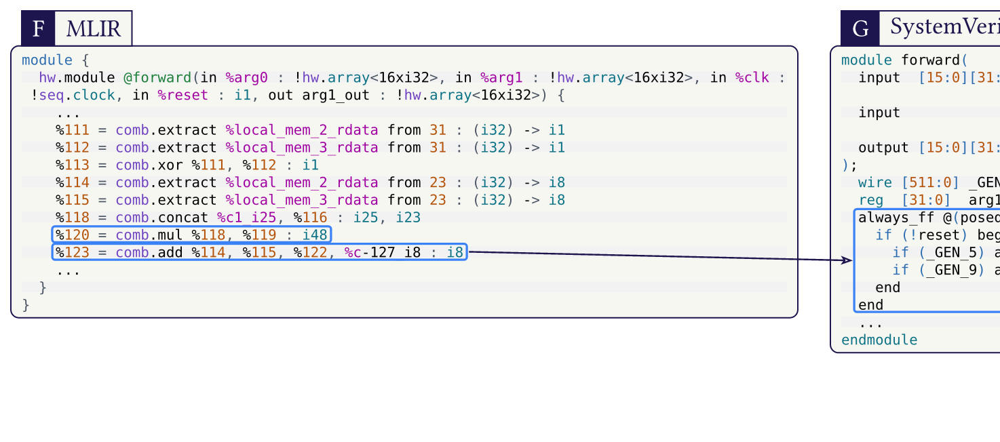

## codez

Mark and annotate code blocks with geometry-friendly anchors for slides and posters.

`codez` is built for cases where code is a visual object: you mark semantic ranges once, then reuse them for bboxes, dots, arcs, or custom Cetz overlays.

### Install

```typ
#import "@preview/codez:0.1.0": *
#show: init.with()
```

### Public API

- `init`
- `mark`, `bbox-mark`, `mark-char`
- `parse`, `pick`
- `block`, `cetz-block`
- `bbox-info`, `anchor`, `bbox`
- `canvas`, `overlay`, `dot`, `arc`

### Curated Examples (from your slides/poster)

- [Emeraude Touying excerpt (SwiGLU + MatMul, MLIR only)](examples/touying-emeraude-mlir.typ)
- [Holigrail POP poster excerpt (MLIR to SystemVerilog)](examples/holigrail-pop-excerpt.typ)

### Preview Gallery

[](docs/previews/touying-emeraude-mlir.pdf)
[](docs/previews/holigrail-pop-excerpt.pdf)

### Syntax Theme

MLIR color style used in these examples is bundled in:
- [`syntaxes/codez-light.tmTheme`](syntaxes/codez-light.tmTheme)
- [`syntaxes/mlir.sublime-syntax`](syntaxes/mlir.sublime-syntax)

### Publish Workflow

- [Publishing checklist](docs/PUBLISHING.md)
- Local validation: `./scripts/check.sh`

### Credits

`codez` vendors and extends parts of `codly` (MIT), adapted for geometry-aware overlays.
See [THIRD_PARTY_NOTICES.md](THIRD_PARTY_NOTICES.md).
