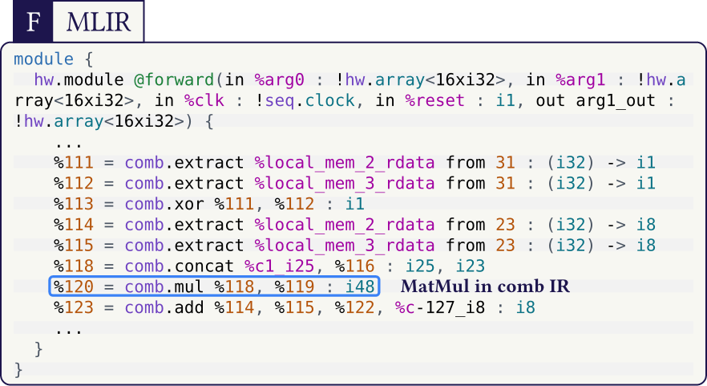

## codez

Text highlights that render inside CeTZ figures, enabling beautiful and complex code explanations for posters and slides.

`codez` is built for workflows where code is a visual object. It solves a limitation of many other package approaches that do not render properly inside CeTZ-based figures.

### Install

```typ
#import "@preview/codez:0.1.0": *
#show: init.with()
```

### Public API

- `init`
- `mark`, `bbox-mark`, `mark-char`
- `parse`, `pick`
- `block`, `cetz-block`
- `bbox-info`, `anchor`, `bbox`
- `canvas`, `overlay`, `dot`, `arc`

### Reference Examples

- [SwiGLU + MatMul with Python math annotation](examples/mlir-swiglu-matmul.typ)
- [MLIR to SystemVerilog (Poster)](examples/mlir-to-systemverilog-poster.typ)

### Preview Gallery

[](docs/previews/mlir-swiglu-matmul.pdf)
[](docs/previews/mlir-to-systemverilog-poster.pdf)

### Syntax Theme

MLIR color style used in these examples is bundled in:
- [`syntaxes/codez-light.tmTheme`](syntaxes/codez-light.tmTheme)
- [`syntaxes/mlir.sublime-syntax`](syntaxes/mlir.sublime-syntax)

### Publish Workflow

- [Publishing checklist](docs/PUBLISHING.md)
- Local validation: `./scripts/check.sh`

### Credits

`codez` vendors and extends parts of `codly` (MIT), adapted for geometry-aware overlays.
See [THIRD_PARTY_NOTICES.md](THIRD_PARTY_NOTICES.md).
